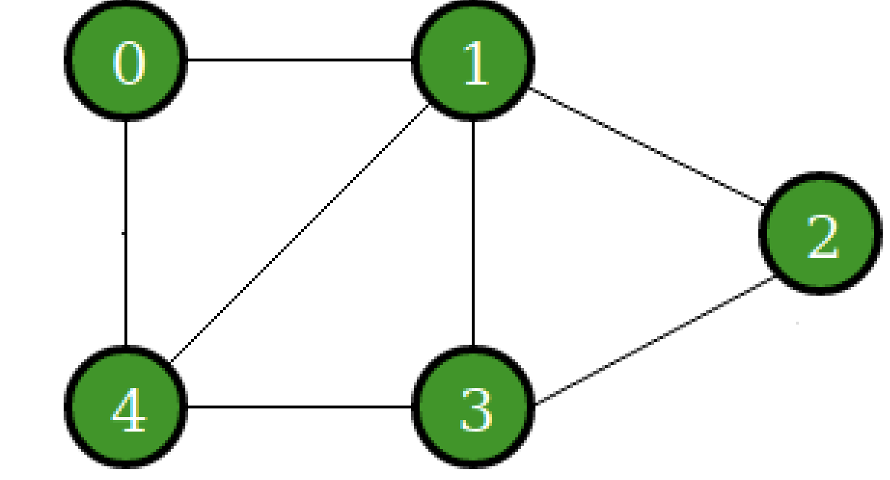
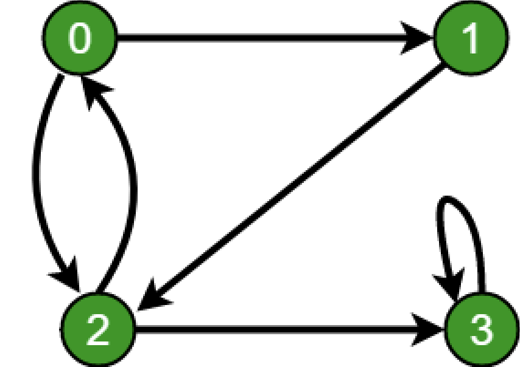

# Directed and Undirected Graphs


In Assignment 4 you implemented what is callled a [binary search tree](https://en.wikipedia.org/wiki/Binary_search_tree) 
or a *BST*. In this assignment we are going to look at another data strucutre, the [graph](https://en.wikipedia.org/wiki/Graph_(abstract_data_type)).

## The Tree.
 

As a reminder we have looked at one type of graph already--a tree. A tree is a special instance of a graph which by definition cannot have cycles. Trees also go by another name--directed acyclic graph(DAG), which implies they are directed graphs. A tree contains nodes (or vertices) which only point to its children to show a hierarchical relationship (i.e. children nodes do not point up to a parent or grandparent). So when traversing a tree, we have a root node where we start and we can traverse down each level in the tree to each child node to uncover its data.

<br><br><br><br><br>

## The graph

A graph more generically is a data structure that can model many types of relationships. Graphs can have cycles and can be directed or undirected and have positive or negative weights associated with each edge. The graph shown on the left is undirected where as the graph on the right is directed. 

  

In the graph on the left we can go from node 0 to node 1 or vice verse. However, in the graph on the right we can go from node 0 to node 1 but we cannot go from node 1 to node 0 directly, we have to find another path (i.e. visit node 2 and then visit node 0). 

Just like in a tree, in a graph, the nodes are called vertices and the connections are called edges. 


## How do we represent graphs

There are two ways to represent graphs:

1. An adjacency list (i.e. neighbor's list )
2. An adjencency matrix ( shown in this week's lab (lab5) ).

### A neighbor's list

The idea here is that each node stores a list of its neighbors. Rather than having a single right and left child like in a BST, a node has a list of neighbors. 

Let's revist our node class to see how this can be done: 

```c
//This is the node we used for our BST.  
typedef struct node{
	int data;
	struct node* rightChild;
        struct node* leftChild;
}node_t;
```

Our graph node_t differs however, one of its fields will be a list of neighboring nodes we are connected to (i.e. adjacent to)

```c
typedef struct node{
	int data;
	struct node* next;
	struct neighbor* neighbor;
}node_t;
```

A third structure, `neighbor_t` is like our `node_t` struct for a singly linked list.

```cpp
typedef struct neighbor{
	int data; // This is the node we are connected to.
	struct neighbor* next;
}neighbor_t;
```

So while we previously learned about an adjacency matrix where one could use an array to store the neighbors: ask yourself, why might this be problematic? An answer is that you have to be careful to allocate enough space for all of your neighbors. If you run out of space you may have to perform an expensive copy operation(O(n)), or if you have too much space, you are wasting precious memory.

*Note* the `node* next` field in the `node_t` struct. This links all or our nodes in the graph together. It is just a single linked list for our nodes. The `node* next` doesn't have to do anything with the neighbor of the node but just a way to get to the next node in the graph. 

Lets see how our neighbor's lists would look for following graph: 

 

Then our neighbor's list is going to look like this:

 

Note that 1 is listed as neighbor of 0, but also 0 is listed as neighbor of 1. This is because the graph is undirected and one can go in either direction. If the graph is directed this would not be the case. 

What we are left to do is our <code> graph_t </code> structure? Some useful functionality would be to store the number of nodes, the number of edges, and the actual nodes of the graph. We have to decide what data structure we are going to use to store the nodes. We could either use a list or an array. If we chose array we have to make sure we don't run out of space.  

If we choose a single linked list our `graph_t` will look like this:

```cpp
typedef struct graph_t{
	int numNodes;
        int numEdges;
	struct node_t * nodes;
}graph_t;
```

As you can see, this is why we need a `node_t * next` field in our node struct. We need to create a singly linked list of nodes that make our graph. Each node then has a singly linked linked list of neighbors. The neighbor nodes just store the data that the actual nodes store, **not** the actual nodes. If we want to get the actual node, we need to traverse our list of nodes and find the node that corresponds to that data and we know that two nodes cannot contain the same data in our graph as we do not allow duplicates. 

## TO DO

### Part 1

For part 1, you will be implementing the following functions using the adjacency list (i.e. neighbor list) approach.

* `add_node(graph_t * g, int value)`

* `add_edge(graph_t * g, int source, int destintaion)` this adds an edge from source to destination but not the other way.

* `remove_edge(graph_t * g, int source, int destination)` this removes an edge from source to destination but not the other way.

* `remove_node(graph_t * g, int value)` this removes the node from the graph along with any edges associated with it. That is, this node would have to be removed from all the neighbor's lists that countain it. 

* `contains_node( graph_t * g, int value)` returns 1 if the node exists 0 otherwise

* `contains_edge( graph_t * g, int source, int destintaion)` returns 1 if an edge from source to destination exists, false otherwise.

* `getNeighbors( graph_t * g, int value )` returns an int array of all the neighbors of the node with data=value.

* `numNeighbors( graph_t * g, int value)` returns the number of neighbors for the node with value.

### Part 2

Implement the following functions using the implementation of *Part 1*

* `is_reachable(graph_t * g, int source, int dest)` returns 0 if I can reach the destination from source, -1 otherwise ( using BFS)

* `has_cycle(graph_t * g)` returns 0 if there is a cycle in the graph, -1 otherwise (using BFS or DFS)

* `print_path(graph_t * g, int source, int dest)` prints any path from source to destination if there exists one (Choose either BFS or DFS, typically DFS is much simpler)

## A hint on writing the traversal algorithms

As you've seen in class, there needs to be away to figure out if a node has already been visited when traversing a graph so we don't end up in an infinite loop. There are two approaches to go about this:

1. Introduce a `int visited` field in our `node_t` struct that is 1 if the node has been visited otherwise 0. If you choose to go this route you would need to reset all *visited* flags in each node to 0 before doing a new traversal.

2. You could have a single linked list, or a BST that stores all the nodes that you've already visited. Note that your single linked list or BST will store just the values of the nodes, not the nodes itself, which makes this more straight forward.  

# Unit Tests

A unit test is a standalone test that checks for the correctness of a specific use case in your code. In our case, we are testing if we have a working *graph_t* implementation. 

You *may* also consider writing some unit tests to test your implementation (In fact, we would strongly encourage you to do so). Note that you can include your unit tests in your submission, and we will have our own test suite. 


# Rubric

- 50% Part 1 correct graph implementation
- 50% Part 2 correct function implementation
  - All functions should be implemented. Do not rename the functions, but you may add any 'helper' functions if you deem necessary.
  - There should be no memory leaks
  - There should be no bugs in your functions 
  - Your implementation will be graded by our set of unit tests, and we will check your code 'style' as well.

# Resources to help

- This is a nice interactive tutorial for learning C
  - http://www.learn-c.org/
- Graph Data Type High level description
  - [https://en.wikipedia.org/wiki/Graph_(abstract_data_type)](abstract_data_type)
  
# Feedback Loop

(An optional task that will reinforce your learning throughout the semester)

- Investigate/Review more data strutures on this webpage: https://visualgo.net/en/graphds
  - There are visuals for the graph there!
  - Use them as a *rough* outline for the general concept. Do make sure to follow the specifications above.
