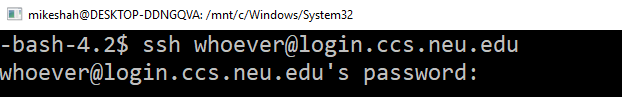

# Terminal Overview

> "Name 10 terminal commands"

That was a prompt I was given when interviewing for LinkedIn several years ago, and that was not the first time someone had asked me about the terminal at an interview! It's not that you should memorize 10 terminal commands, but rather you should understand that working on the terminal is an essential skill.

In this lab, you are going to perform a few terminal commands to get familiar with the Unix Environment along with some other standard tools used throughout this course (and that you will use in your career!).

## Part 0 - Obtain the mono repo

1. Make sure you have accepted the invitation to the monorepo from the main course page.
2. Run through the following github tutorial if you are not familiar with git.
  - https://guides.github.com/introduction/git-handbook/
  - This is worth the 15 minutes it takes to avoid headaches later on!
  - Video guides if needed: https://www.youtube.com/githubguides

## Part 1 - SSH

**I don't care what operating system you use locally as long as you have a terminal and internet access**

### ssh clients for each operating system

* For Windows Users installing Putty is sufficient. (https://www.putty.org/)
  * You might prefer to also install the bash shell from the Windows Store as well. (https://docs.microsoft.com/en-us/windows/wsl/install-win10)
* For Linux/Mac users, you already have a terminal available! Just search for 'terminal'.
* We additionally will install a virtual machine which you may work from, and which has a terminal.

### ssh'ing
* Once your terminal is open, 'ssh' into Khoury with: `ssh khoury_user_name_here@login.khoury.neu.edu`
  * If for some reason you do not have a Khoury username, [follow these instructions](https://www.khoury.northeastern.edu/systems/getting-started/)
* After you have successfully ssh'd, you are now running programs on the Khoury servers (i.e. not locally on your machine).

## Part 1.5 - Obtaining your repo (i.e. cloning your repository)

When you have successfully ssh'd into your repository (Part 1) you should download a copy of your repository on the Khoury servers. The rough workflow for using git is the following.

1. Run `git clone your_repository_url` to establish a git repository on your system. *your_repository_url* is found by clicking the 'green' button on you Monorepo homepage(move one directory up from this folder).

	i. It should look something like `https://github.com/CourseName/Monorepo-yourname.git`
	
2. When you make a change to a file within this directory you can see what is different by:

	i. run `git status` to see what you have changed locally on your computer. Changes you have made locally have not yet been saved to github's servers. 

3. When you are happy with your changes do `git add whatever_file.c` which prepares that specific file to be added to the master. [[git add documentation](https://git-scm.com/docs/git-add)]

4. Next, you will do `git commit -m "some informative message about your changes"` to record changes in your repository [[git-commit documentation](https://git-scm.com/docs/git-commit)]

5. Finally, do a `git push` to actually make things happen--meaning everything you have added will go to the github server. You can check your github.com repository to see exactly what I will see. [[git push documentation](https://git-scm.com/docs/git-push)]

A cheatsheet has been added to the repository (Under /ExternalResources) that may be helpful!

## Part 2 - The (at least) 10 Commands

Try running the following commands (See deliverables section at the end for copying and pasting to output.txt).

1. ls - lists the files and folders in the current directory.
2. mkdir - Create a new directory
3. cd - Change directory
4. man - Manual pages
5. rmdir - Removes an empty directory
6. sort - Sorts information
7. cat - Concatenates files and prints them to standard output
8. nl - Outputs a file with number of lines
9. cut - Remove sections from each file
10. grep - Prints lines that match a pattern.

### Navigating the terminal quickly.

Here are some other nice things to know with the terminal.

* Pressing up and down arrowkeys iterates through your command history (There is also a commmand called *history* you can checkout).
* Pressing *tab* autocompletes if it finds a program, command, or file path.
* Pressing Ctrl+C sends a signal to the terminal to terminate a program if it gets stuck.
* Pressing Ctrl+Z sends a signal to the terminal to suspend a program and give you back control.
  * You can play with these by typing in *sleep 10* (which puts the terminal to sleep) for 10 seconds, and see how you can terminate this program.
* Practice getting help by typing `man ssh` into the terminal. (Press q to quit the manual pages).

### A bit of precision
Calling each of these 'commands' (i.e. ls, sort, cat, etc.) is not really correct. Each of these is itself a program (typically implemented in C or some other language).

As an example, here is the source code for 'ls': http://git.savannah.gnu.org/cgit/coreutils.git/tree/src/ls.c
Each of these commands are part of the coreutils package in Unix. If you look through the source tree, you will additionally find many other programs (i.e. terminal commands you run in your shell) here: http://git.savannah.gnu.org/cgit/coreutils.git/tree/src/.

## Part 3 - Learn-C

The main programming language we will be using in this course is "C".

Complete the 'Learn the Basics' section of the C tutorial on the web from http://www.learn-c.org/
(If for some reason learn-c.org is down, run through the examples provided in the slides)

- [Hello, World!](http://www.learn-c.org/en/Hello%2C_World%21)
- [Variables and Types](http://www.learn-c.org/en/Variables_and_Types)
- [Arrays](http://www.learn-c.org/en/Arrays)
- [Multidimensional Arrays](http://www.learn-c.org/en/Multidimensional_Arrays)
- [Conditions](http://www.learn-c.org/en/Conditions)
- [Strings](http://www.learn-c.org/en/Strings)
- [For loops](http://www.learn-c.org/en/For_loops)
- [While loops](http://www.learn-c.org/en/While_loops)
- [Functions](http://www.learn-c.org/en/Functions)
- [Static](http://www.learn-c.org/en/Static)

Once you are comfortable write a C program on the Khoury machines in the file **main.c**.

1. The program will contain a function with the signature 'double power(double base, double n)'.
2. Your program will call this function in a loop in the main function, computing the first power(2,1) to power(2,10) and print out these results to the terminal.  
3. You can compile your program with: `clang main.c -o main` to see if it works. 

Here is a little tutorial on VIM as a resource: https://www.howtoforge.com/vim-basics (Note I use VIM, and have limited knowledge of other editors, but you are free to use what you like).

# Part 4 - The Network is down! How to work locally.

Sometimes ssh is not available if the internet is not. Hmm, how will we then work on our Khoury machines which are in a linux environment? The solution is to install locally (i.e. your desktop machine) a virtual machine. A virtual machine emulates an entire operating system!

Here appear to be two useful videos on getting setup:

1. [Installing Ubuntu in Virtual Box on Windows](https://www.youtube.com/watch?v=QbmRXJJKsvs)
2. [Install Ubuntu in Virtual Box on Mac](https://www.youtube.com/watch?v=4SbTXqPk_1Y)

The instructions to get setup are here:

**Note** If you are on windows and have the Windows Linux Subsystem, you can submit a screenshot of that running. That *should be* sufficient for most things in this course. And if you are using linux...just submit a screenshot of your desktop (You may still find the exercise useful however--especially if you want to test software on multiple OS's).

* First start downloading the operating system I recommend using: Ubuntu https://www.ubuntu.com/download/desktop
  * While our Khoury machines are actually CentOS for the operating system, Ubuntu will work just fine (They core kernel is the same).
  * The download is rather large, so start with this step! :)
* Visit https://www.virtualbox.org/
* Download the binary for Virtual box 5.2 or later.
  1. This will show up as "Windows hosts" for window users, OSX hosts for mac users, etc.
* Install the program using the default installation settings (i.e. you will click 'next' a bunch of times).
* When installation has completed, launch Virtaul Box.
* Next click 'new' in the top right, and select *Linux* from the 'Type' dropbown box.
  1. You can name it something like 'myUbuntuMachine'
  2. Click 'next'
  3. You can then configure the memory size. I recommend at least 4096 MB (Unless that is not more than half of what you have available).
  4. Click 'next' and then create a Virtual Hard disk(default option). This essentially creates a giant file that acts like a hard drive.
  5. You can create a VDI (Virtual Disk Image). Click next.
  6. For the storage, you can select 'Dynamically allocated'
* Okay, now you are configured, and ready to boot your OS!
  1. Go ahead and right-click on your machine name, and select 'start'. 
  2. This will begin launching your virtual machine (It may take a few minutes to create some files)
  3. The first dialog will ask where your media is, and you will select wherever you downloaded the Ubuntu 18 .iso file (in step 1).
  4. Then run through the 'normal install'
  5. Follow the dialogs to install Ubuntu.
  6. Remember, you are working within a virtual environment, so this installation is only taking place within virtual box.
  7. From within Ubuntu, try opening a terminal. Run `sudo apt-get install build-essential` to make sure you get some tools(like our compiler gcc) setup.

Again, if you have a linux machine you may not need a virtual machine. What is nice about a virtual machine however, is if you mess something up, you can always reboot it and start from scratch very easily.

## More resources to help

- There is a lovely user manual on Virtual Box here: https://www.virtualbox.org/manual/
- There is another example of installing an older Ubuntu on an older version of virtual box here with pictures: https://askubuntu.com/questions/142549/how-to-install-ubuntu-on-virtualbox
- If you are not comfortable with compiling a C program on the terminal, take a look at this resource: https://www.cs.fsu.edu/~myers/howto/g++compiling.txt
- Hackerrank has an excellent series of shell tutorials here: https://www.hackerrank.com/domains/shell/bash
  - I highly recommend going through them if you are not comfortable with the shell.
- **If you accidently delete something** you can navigate to `cd .snapshot/` which will show files that have been periodically backed up for that current directory. This is yet anothe reason to make sure you are working within the Khoury systems which provide this backup service.
- A pretty good introduction to shell scripting is here: https://www.howtogeek.com/67469/the-beginners-guide-to-shell-scripting-the-basics/ .

## Deliverable

* Copy and Paste the output from the command-line interface of you running five different terminal commands above into a file called "output.txt" (no capitalization, exactly as named.)
  * Make sure to 'add/commit/push' this file to the repo in this directory.
* Modify the file called 'main.c' in your respository containing the power example.
  * Make sure to 'add/commit/push' this file to the repo in this directory.
* Take a screenshot of your virtual environment running. Name it 'linux.jpg'
  * Make sure to 'commit' this file to the repo in this directory.

## Going Further

(Some more terminal programs to research and try out on your own time)

1. history
2. tree
3. touch
4. awk
5. sed
